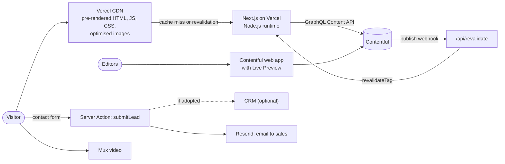
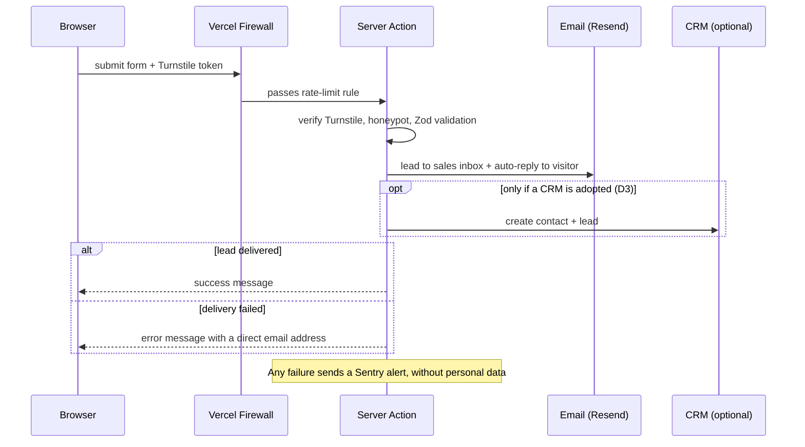

# Brand Portfolio Platform — Architecture Plan (v2.9)

| | |
|---|---|
| **Status** | Draft for review |
| **Owner** | Project Head |
| **Last updated** | 8 Oct 2026 |
| **Supersedes** | `Brand Portfolio Project Architecture & Execution Plan.pdf` (v1) |
| **Companion docs** | [README.md](README.md) (living brief) · [execution-plan.md](execution-plan.md) (tasks, owners, timeline) |
| **Reference** | tekrevol.com — for scope and feel, not to copy |

### Revision history

| Version | Date | Change |
|---|---|---|
| v2.9 | 8 Oct 2026 | Optional **hero layers** on `caseStudy` (`0004-case-study-hero-layers.cjs`): the hero image as stacked pieces that float (§6) |
| v2.8 | 8 Oct 2026 | **Case-study template extended for the CRM Terminal Gateway design** (`0003-case-study-sections.cjs`): hero layout (Split or Centered), `caseStudyFeatureGrid` (numbered features) and `caseStudyShowcase` (wide image) sections (§6) |
| v2.7 | 8 Oct 2026 | **Case-study content model created** (`contentful/migrations/0002-case-study-model.cjs`): a case study is a hero plus **ordered sections** (text + image, tech stack) instead of fixed challenge / solution / results fields, because each case-study design has its own sections (project head decision, §6). `/case-studies/[slug]` renders it; the hard-coded Gulbaan page is gone. Rich Text uses our own small renderer for now (§4). Folder structure updated (§7) |
| v2.6 | 3 Oct 2026 | **Blog content model created** (`contentful/migrations/0001-blog-model.cjs`: `category`, `person`, `seo`, `post`), run with `npm run contentful:migrate`; the home page shows the 3 newest posts. **Interim caching:** Contentful reads use the Next.js fetch cache (`force-cache`, hourly `revalidate`, `tags`) until the blog pages switch the site to Cache Components (§5, P3-02) |
| v2.5 | 2 Oct 2026 | **Animation: GSAP** (ScrollTrigger, ScrollSmoother) decided by the project head, with smooth scrolling; Motion dropped. Static content moved into `src/content/` |
| v2.4 | 1 Oct 2026 | **Content split** (project head decision): Contentful holds only case studies and blog posts; every other page is static content in code. Removed the `/[slug]` CMS-page route and the `service`, `industry`, `page`, section, `siteSettings`, `redirect`, `office`, and `faq` content types; redirects move to code. **npm** and **`src/`** confirmed. Contentful connected; content types are created as migrations when the case-study and blog pages are built. Static-page images live in `src/assets/images/` |
| v2.3 | 30 Sep 2026 | **Codebase scaffolded.** Framework, TypeScript strict, Tailwind CSS v4, and ESLint (flat config) are now in the code. The scaffold uses npm and has no `src/` folder; both are flagged in §4 and §7 until the project head decides |
| v2.2 | 30 Sep 2026 | **Postgres dropped** (project head decision): Contentful is the only data store. Leads are emailed to a shared sales inbox; a CRM is optional (D3). Upstash replaced by a Vercel Firewall rate-limit rule |
| v2.1 | 30 Sep 2026 | CMS changed to **Contentful** (project head decision); Sanity dropped. SQL database proposed for removal |
| v2 | 30 Sep 2026 | Full review and rewrite of the v1 PDF |

---

## 0. Summary

We are building the company's brand portfolio and lead-generation site: services, industries, case studies, blog, and contact, aimed at national and international clients. Three things matter most: **search visibility**, **speed**, and **marketing autonomy** (editors publish without developers).

The approach is **one Next.js application**. React is the component layer inside Next.js, not a separate front-end. Nearly every page is **pre-rendered to static HTML and served from a global CDN**. **Case studies and blog posts** come from **Contentful** and refresh **within seconds** when an editor publishes. Every other page (home, services, industries, about, contact, legal) is **static content in the code** and changes with a deploy. The only per-request server work is the contact form, editor previews, and webhooks.

There is **no database of our own**. Case studies and blog posts live in Contentful; contact-form leads are emailed to the sales inbox (and sent to a CRM, if sales adopts one). "Static" does not mean "no content source": Next.js reads Contentful when the site is built and whenever an editor publishes, then serves ready-made HTML. Visitors never wait on Contentful.

### What changed from v1

| Area | v1 | v2.1 | Why |
|---|---|---|---|
| React vs Next.js | Described as front-end + server layers | One Next.js app; React is its component layer | No split architecture to build or maintain |
| Rendering | "SSR/SSG/ISR", `revalidate = 3600` | Static by default + on-demand revalidation from a Contentful webhook (Next.js 16 Cache Components) | Editors see changes in seconds, not up to an hour. Static HTML is as good as SSR for SEO, and faster |
| CMS | Sanity / Strapi | **Contentful** | Project head decision after research (30 Sep 2026) |
| What the CMS holds | All page content | **Case studies and blog posts only**; other pages are static content in code | Project head decision (30 Sep 2026): about 8 content types instead of 20; editors focus on the content that changes often |
| Other "/" choices | Cloudinary / S3, Vercel / Amplify, Prisma / Drizzle | One decision per layer, with alternatives and when to switch | A plan with "/" is not a decision |
| Database | PostgreSQL for leads, routing, "custom performance metrics" | **None** (project head decision). Contentful holds content; leads are emailed to sales (CRM optional); metrics come from Speed Insights and analytics | A marketing site has no user accounts or transactions to store. Less to secure, back up, and maintain |
| SEO library | next-seo | Built-in Metadata API, `opengraph-image`, `sitemap.ts`, `robots.ts` | next-seo targets the old Pages Router; the App Router has this built in |
| Folder structure | `case-studies/` outside the `(marketing)` route group | All public routes in one group sharing header and footer | In v1, case study pages would have rendered **without the header and footer** |
| Missing routes | — | Blog, industries, legal pages, 404/error, revalidate webhook, draft mode | Needed for launch |
| Security timing | Rate limiting in Phase 4 | Built with the form in Phase 3, plus a bot check (Turnstile) | Security is not an afterthought |
| Performance timing | Optimisation in Phase 4 | Budgets enforced in CI from Phase 1 | v1's own anti-patterns said not to defer this |
| Success metrics | Lighthouse ≥ 95 | Lab + field Core Web Vitals, including INP | Google ranks on field data; INP replaced FID in March 2024 |
| Missing workstreams | — | Discovery & design, content, SEO migration, consent/GDPR, monitoring, testing, team, risks, launch checklist | This is where agency-site projects usually slip |
| Framework version | Unspecified | Next.js **16.3.x** (pin ≥ 16.3.6); `middleware.ts` → `proxy.ts` | Current stable; 16.3.6 is the 22 Sep 2026 critical security release |

---

## 1. Decisions needed before design sign-off

These change the architecture or budget. Each needs an answer by the end of Phase 0. The right-hand column is what we build if nobody decides.

| # | Question | Why it matters | Default |
|---|---|---|---|
| D1 | Which languages/markets at launch and within 12 months? Any right-to-left (Arabic, Urdu)? | Changes routing (`app/[locale]/…`), fonts, and layout direction. Contentful's free plan allows **2 locales**; the next tier allows 3 | English only, with locale-ready routing from day 1 if a second language is likely within 12 months |
| D2 | Is there an existing site/domain with search traffic? | Requires a URL audit and a 301 redirect map to keep rankings (§8) | Assume yes; plan the migration |
| D3 | Does the sales team use a CRM (a tool to track leads and deals, e.g., HubSpot, Zoho, Salesforce)? If not, do they want one? | Decides where leads go besides the sales inbox (§11) | Launch with email to a shared sales inbox; add HubSpot's free CRM when sales is ready |
| D4 | Any company rule on hosting or data location (must be AWS, data residency)? | Vercel vs self-hosted; Contentful data region | Vercel; Contentful default region |
| D5 | Monthly SaaS budget? | Contentful's next tier after free is roughly **$300/month**; Vercel Pro is per seat + usage | Contentful free + Vercel Pro, if the free plan's terms and limits fit |
| D6 | Team size and target launch date? | Timeline in §13 assumes the team in §14 | ~12 weeks |
| D7 | Are Figma designs ready, or does design start now? | Adds 3–4 weeks if starting from scratch | Design starts now |
| D8 | Who edits content, and how many people? | Contentful's free plan caps users (sources say 5–10) and has only basic roles | 3–5 editors |

**Contentful plan check (Phase 0, owner PH):** confirm on contentful.com/pricing that the plan we choose fits users (D8), locales (D1), environments (we need 2), content types (free tier ≈ 48; §6 uses about 8), records, API calls, and bandwidth. Also confirm the free plan's terms allow a commercial production site. Third-party summaries disagree on some free-plan numbers, so trust only the official page.

---

## 2. Goals and measurable targets

| Goal | Target | Measured by |
|---|---|---|
| Speed (field, real users) | p75 mobile: **LCP ≤ 2.5 s, INP ≤ 200 ms, CLS ≤ 0.1** | Vercel Speed Insights; CrUX via Search Console |
| Speed (lab, every template) | Lighthouse mobile Performance **≥ 90** (stretch 95), desktop **≥ 95** | Lighthouse CI on every pull request |
| SEO hygiene | Lighthouse SEO 100; no indexable page missing title, description, or canonical; valid JSON-LD | Lighthouse CI, Rich Results Test, Search Console |
| Accessibility | **WCAG 2.2 AA**; Lighthouse a11y ≥ 95; zero critical axe issues | axe in Playwright + manual keyboard and screen-reader pass |
| Editor autonomy | An editor publishes a new case study end-to-end with no developer, live within 60 s | Acceptance test at end of Phase 3 |
| Lead reliability | No lead silently lost; sales notified within 1 minute | Resend delivery logs; Sentry alerts |
| Availability | 99.9 % | Uptime monitor |

**Why 90, not 95, on mobile lab scores:** Lighthouse mobile emulates a slow phone on a throttled network. With rich agency visuals and marketing tags, 95 is fragile, and the lab score is not what Google ranks on. Field Core Web Vitals are the real bar; 95 stays as the stretch goal.

---

## 3. Architecture



### Rendering principle

Pre-render everything that is the same for every visitor. SEO does not need per-request server rendering. It needs complete HTML in the first response, and pre-rendered HTML delivers that faster and cheaper. Per-request rendering is only for what genuinely varies per request.

| Route | Content source | Rendering | Freshness |
|---|---|---|---|
| `/`, `/about`, `/services`, `/industries` | Code | Static | Deploy. Any case-study cards on these pages refresh via the Contentful webhook |
| `/services/[slug]`, `/industries/[slug]` | Code; related case studies from Contentful | Static, all slugs via `generateStaticParams` | Deploy; related case studies via the Contentful webhook |
| `/case-studies` | Contentful | Static page; filtering happens client-side over pre-rendered card data | Contentful webhook → `revalidateTag` |
| `/case-studies/[slug]` | Contentful | Static via `generateStaticParams`; new slugs render on first request, then are cached | Contentful webhook |
| `/blog`, `/blog/[slug]`, `/blog/category/[slug]` | Contentful | Static | Contentful webhook |
| `/privacy-policy`, `/cookie-policy`, `/terms` | Code | Static | Deploy |
| `/contact` | Code | Static page; the form submits to a Server Action | — |
| Draft mode (editors only) | Dynamic; bypasses cache; reads Contentful's **Preview API** to show unpublished content | — |
| `/api/revalidate`, `/api/draft-mode/*` | Route handlers | — |

### How freshness works (Next.js 16 Cache Components)

1. `cacheComponents: true` in `next.config.ts`.
2. Contentful fetch functions use `'use cache'` with `cacheLife('max')` and tags such as `cacheTag('caseStudy', 'caseStudy:<slug>')`.
3. On publish or unpublish, Contentful sends a webhook to `/api/revalidate`. The handler verifies the request with Contentful's webhook signing secret, then calls `revalidateTag(tag, 'max')` for the changed entry.
4. The next visitor gets the cached page instantly while the new version renders in the background. Everyone after that sees the update.

This replaces v1's time-based `revalidate = 3600`, where editors could wait up to an hour to see changes.

**Until then (since 3 Oct 2026):** `cacheComponents` is not on yet, because turning it on means reworking the placeholder routes (`/blog/[slug]` and others) at the same time. `contentfulQuery()` uses the fetch cache instead: `cache: 'force-cache'`, `next.revalidate` (1 hour) and `next.tags` (e.g. `post`). The tags already match step 3, so the webhook works either way; the hourly refresh is only the fallback until it exists. Switch to steps 1–2 with P3-02, when the blog pages are built.

**API usage:** visitors never call Contentful. Calls happen only at build time, on revalidation, and in editor preview. Every PR preview deployment is a full build, though, so watch the monthly API-call quota. Use GraphQL to fetch each page in one request, and cap build concurrency.

### Case study filtering

- The listing page is static. It pre-renders lightweight card data for every case study (title, slug, thumbnail, industry, service, region).
- Filters (industry, service, region) run client-side and update the URL (`?industry=fintech`) so filtered views are shareable. The canonical URL points to the unfiltered listing.
- **Indexable** topic pages are `/industries/[slug]` and `/services/[slug]`, which list related case studies. Filter URLs are not indexable.
- Services and industries are defined in code, so a case study cannot link to them as Contentful entries. Instead, its `services` and `industries` fields accept only values from a fixed list that matches the slugs in code (a Contentful field validation). Adding a service or industry means updating the code and that list together.
- Revisit if the site grows past roughly 200 case studies; switch to server-side filtering and pagination then.

---

## 4. Tech stack — one decision per layer

| Layer | Decision | Why | Switch to the alternative if |
|---|---|---|---|
| Framework | **Next.js 16.3.x** (App Router, React 19.2, TypeScript strict), `cacheComponents: true`, Turbopack (default). **In code:** Next.js 16.3.7, React 19.2.8 (`cacheComponents` not enabled yet) | Static generation + on-demand revalidation, Metadata API, image/font optimisation, Server Actions | — |
| Runtime | **Node.js 24 LTS** (Next 16 needs ≥ 20.9) | Current LTS | — |
| Package manager | **npm** (project head, 30 Sep 2026; replaces the earlier pnpm proposal) | Comes with Node.js; the scaffold already uses it | — |
| Styling | **Tailwind CSS v4**, design tokens in `@theme`. **In code:** via `@tailwindcss/postcss`; no `tailwind.config.js` | Small CSS output; tokens become CSS variables | — |
| UI primitives | **shadcn/ui** (Radix underneath) | Accessible, code lives in our repo, no runtime lock-in | — |
| Animation | **GSAP** with ScrollTrigger and ScrollSmoother (`@gsap/react` for React cleanup), all free since 2025 — **decided by the project head (2 Oct 2026)**, including smooth scrolling. Plain CSS for the hero entrance, the header scroll effect, and simple hovers. `CountUp` uses plain browser APIs | Precise control for scroll-driven effects, the tab highlight, and inertia scrolling; one library for everything | GSAP's size becomes a problem → load ScrollSmoother only on desktop, or lazy-load GSAP after first paint. Never add a second animation library (e.g. Motion) |
| CMS | **Contentful**, for **case studies and blog posts only** — editors work in the Contentful web app with **Live Preview** (`@contentful/live-preview`). All other page content is static in code | **Decided by the project head (30 Sep 2026).** Hosted, nothing to run; field-level localisation built in; mature workflows and roles | A static page type needs frequent edits by marketing → move it into Contentful (about 2–4 days per page type) |
| Content access | Contentful **GraphQL Content API**, called with `fetch` from server-only `src/contentful/client.ts` (no SDK). **In code** since 30 Sep 2026. TypeScript types generated with `graphql-codegen` once content types exist | Each page fetches exactly the fields it needs in one request; typed end to end | — |
| Content model | Managed **as code** with Contentful migration scripts, run in CI. Created when the case-study and blog pages are built (P3-01) | Reviewable, repeatable changes; no clicking in production | — |
| Rich text | `@contentful/rich-text-react-renderer` with our own components per node type. **In code (8 Oct 2026):** a small renderer of our own, `src/contentful/rich-text.tsx`, covering what case-study sections allow (paragraphs, bold/italic/underline, links, lists); the package was not installed | Editors get rich text; output stays on-brand and accessible | Fields need embedded entries or assets, or blog articles need the full node set → install the package and keep our components per node type |
| Images | `next/image` with **Vercel image optimisation**. Case-study and blog images: Contentful as the source (`images.ctfassets.net` in `remotePatterns`). Static-page images: files in `src/assets/images/`, statically imported so their size is known at build time (project head, 1 Oct 2026) | Vercel caches optimised images, so Contentful's bandwidth quota is hit once per image variant, not on every visit | Vercel image cost grows → custom loader using Contentful's Images API (`fm`, `w`, `q` parameters) |
| Video | **Mux** (adaptive streaming, posters; Contentful app available) | Contentful stores files but does not stream adaptively; hero and case-study video must not hurt LCP | Cloudinary, if already licensed |
| Forms | **Server Action + Zod** (one schema shared by client and server) + **React Hook Form** for client UX | Works without JavaScript; one source of validation truth | — |
| Bot and abuse protection | **Cloudflare Turnstile** + honeypot field + a **Vercel Firewall rate-limit rule** on form submissions (included in Pro) | No extra service to run; rate limits alone do not stop bots, so Turnstile adds a free, privacy-friendly check | Need limits per email address or other custom logic → Upstash Ratelimit |
| Lead handling | **No database.** Each lead is emailed to a **shared sales inbox**, with an auto-reply to the visitor (§11). Leads are **never** stored in Contentful | Simplest reliable option; the visitor always sees the real outcome | Sales adopts a CRM (D3) → the form also sends each lead to it |
| CRM (optional) | Per D3. If sales has none and wants one: **HubSpot's free CRM** | Tracks each lead through to a signed deal; shows which pages and campaigns bring clients | Company already uses Zoho, Salesforce, etc. → integrate that instead |
| Email | **Resend + React Email**, sent from our own domain with SPF, DKIM, and DMARC | Delivers leads to sales and confirmations to visitors without landing in spam; templates are React components | AWS SES, if AWS is mandated |
| Hosting | **Vercel Pro** | First-party Next.js support, a preview URL per PR, instant rollback, CDN, firewall | D4 requires AWS → OpenNext (via SST) or Docker `output: 'standalone'` on ECS. Check Amplify's supported Next.js version first; it has historically lagged releases |
| DNS | Registrar DNS or Cloudflare **DNS-only** (no proxy in front of Vercel) | Avoids double-CDN caching conflicts | — |
| Analytics | **GA4 via GTM**, loaded with `@next/third-parties` after consent; **Vercel Speed Insights** for field Core Web Vitals | Marketing already knows GA4/GTM; Speed Insights gives real-user vitals | Add **PostHog** in Phase 6 if conversion work needs funnels or session replay |
| Consent | CMP (e.g., Cookiebot, CookieYes) + **Google Consent Mode v2** | Required for EU/UK visitors and for Google ads measurement in the EEA | — |
| SEO | Next.js Metadata API, `opengraph-image.tsx`, `sitemap.ts`, `robots.ts`; JSON-LD typed with `schema-dts` | Built in; no extra library | — |
| Environment config | **`@t3-oss/env-nextjs` + Zod**. **In code:** `src/env.ts` (Contentful variables so far) | Build fails on missing or invalid env vars; server secrets cannot be imported into client code | — |
| Error monitoring | **Sentry** | Server and client errors with source maps; alerts on failed lead delivery | — |
| Uptime | **Better Stack** or **Checkly** | Alert when home, contact, or sitemap break | — |
| Testing | **Vitest** + Testing Library (unit), **Playwright** (E2E + axe), **Lighthouse CI** | Covers logic, flows, accessibility, and performance budgets | — |
| Code quality | ESLint (flat config) + Prettier, Husky + lint-staged, Conventional Commits, Renovate. **In code:** ESLint 9 with `eslint-config-next` (Core Web Vitals + TypeScript) | `next lint` was removed in Next 16; ESLint runs directly | Biome instead of ESLint + Prettier, if the team prefers |
| i18n (only if D1) | **next-intl** for routing and UI strings + Contentful **field-level locales** for content | Locale routing, `hreflang`, one entry per piece of content across languages | — |

### Deliberately not using

- **A database (SQL or otherwise).** Contentful holds content; leads go to email (and optionally a CRM). Revisit only if we add user accounts, a client portal, or custom dashboards.
- **Leads in Contentful.** It is a content system: editors would see personal data, leads would use up record and API limits, and the website would need a write token. Leads go to email or a CRM, never the CMS.
- **A separate React SPA plus an API server.** Next.js already does both.
- **Edge runtime for application code.** Static pages already sit on the global CDN. The Node.js runtime is the default, and Next 16's `proxy.ts` runs on it.
- **next-seo.** Replaced by the built-in Metadata API.
- **Global state libraries (Redux, Zustand).** Server Components plus URL state cover a marketing site.
- **Redis.** The Next.js cache handles caching, and the Vercel Firewall handles rate limiting.
- **Two animation libraries or two analytics suites at launch.**
- **Microservices, Kubernetes, or a GraphQL gateway.** Nothing here needs them.

---

## 5. Information architecture and URLs

```
/                          Home
/services                  Services overview
/services/[slug]           Service detail
/industries                Industries overview
/industries/[slug]         Industry detail + related case studies
/technologies              Technologies we work with (static)
/case-studies              Portfolio listing with filters ("Our Work" in the menu)
/case-studies/[slug]       Case study
/blog                      Blog listing ("Insights" in the menu)
/blog/[slug]               Article
/blog/category/[slug]      Category archive
/about                     Story, leadership, awards, offices
/careers                   Optional; can link out to the hiring platform
/contact                   Contact form + offices
/privacy-policy            Legal pages — static content in code
/cookie-policy
/terms
```

Content source: case studies and the blog come from Contentful; every other route is static content in code (§3). New landing pages are built by developers.

**URL rules**

- Lowercase, hyphenated, no trailing slash, no IDs or file extensions.
- Slugs are permanent. If one must change, a developer adds a 301 redirect in `next.config.ts` in the same pull request. Editors changing a case-study or post slug ask a developer first.
- Filter state lives in query parameters, with the canonical pointing at the unfiltered page (§3).
- **Location pages** (`/locations/[city]`) only for real offices with unique content. Mass-produced "service + city" pages count as doorway or scaled content under Google's spam policies and can hurt the whole domain.

---

## 6. Content model (Contentful)

Contentful holds **only case studies and blog posts**, plus the small types they link to (project head decision, 30 Sep 2026). Services, industries, offices, FAQs, navigation, page sections, and site settings are static content in code. Contentful has no nested objects, so SEO fields are their own content type, linked by reference. The model uses about 8 content types, far under the plan limit (free tier ≈ 48).

**When:** the content types are created as migration scripts in `contentful/migrations/` when the case-study and blog pages are built (P3-01), not by hand in the web app. **Created so far:** blog (`0001`, 3 Oct 2026) and case studies (`0002`–`0004`, 8 Oct 2026). Rows marked _planned_ are the remaining draft.

**Case studies are sections, not fixed fields** (project head, 8 Oct 2026). The designs give each case study its own section titles and order (Gulbaan: "The Idea Behind Gulbaan", "Platform Features", "Insights from Client"…; CRM Terminal Gateway: "Introduction", "The Challenge", "The Solution", a numbered features grid…), so fixed challenge / solution / results fields cannot build them. A case study is a hero plus an ordered list of section entries; one template renders them all, alternating navy and white so every case study stays consistent. New section types are added as new migrations when a design needs them; the CRM Terminal Gateway design added the Centered hero layout, numbered features, and the wide image (`0003`).

| Content type | Key fields |
|---|---|
| `caseStudy` | title, slug, client → `client`, excerpt, **hero layout** (Split or Centered), hero heading, hero text, hero image, hero layers (optional: the hero image as full-size pieces, back to front, that float), **sections** → `caseStudySection` / `caseStudyTechStack` / `caseStudyFeatureGrid` / `caseStudyShowcase` (in page order), **industries** and **services** (lists limited to the slugs defined in code, §3), region, year, featured flag, seo → `seo`. _Planned:_ hero video (Mux), metrics → `metric[]`, testimonial → `testimonial`, gallery, related case studies, **confidential flag** (show anonymised) |
| `caseStudySection` | title, text (Rich Text: paragraphs, lists, links), image, layout (image left, right, or below) |
| `caseStudyTechStack` | title, cards → `techStackGroup[]` |
| `caseStudyFeatureGrid` | title, intro, features (2–9 short texts, numbered 01, 02… on the page) |
| `caseStudyShowcase` | name (Contentful only), image (full width, no text) |
| `techStackGroup` | label (e.g. "Web Architecture"), technologies (limited to the slugs in `src/content/technologies.ts`, which holds the logos) |
| `client` | name, logo, website, **logo use approved** (yes/no) + approval details (date, approver). The site shows the logo only when approved |
| `metric` | _Planned:_ value, suffix, label (e.g., "3×", "conversion rate") |
| `testimonial` | _Planned:_ quote, person, role, company, photo |
| `post` | title, slug, author → `person`, category → `category`, cover image, body (Rich Text), published/updated dates, seo |
| `category` | title, slug |
| `person` | name, role, photo, bio, social links (blog authors; supports E-E-A-T). Leadership on the About page is static |
| `seo` | title, description, OG image, `noindex` |

**Rules**

- **Alt text:** use the asset's Description field. Editors must fill it in; a scheduled content check lists images without one.
- **Localisation (if D1):** decide per field which fields are translated. Text is translated; logos, metrics, and references usually are not. Static pages are translated in code.

---

## 7. Folder structure

> **Status (1 Oct 2026):** the skeleton of this tree is in the repository (P1-10). `src/` is confirmed and `@/*` points to `./src/*`. Folders without code yet hold a `.gitkeep`.

Fixes over v1: one route group for all public pages (v1 left `case-studies/` outside the shared layout), a required root layout, error and 404 pages, webhook and draft-mode routes, blog routes, and a `server/` folder that client code cannot import. The `(site)` group also leaves room for a later `(landing)` group: campaign pages with minimal navigation.

```
brand-portfolio/
├── .github/
│   ├── workflows/ci.yml              # typecheck, lint, test, build; E2E + Lighthouse on preview URL
│   └── pull_request_template.md
├── contentful/
│   ├── migrations/                   # content model as code; run in CI with the management token
│   └── seed/                         # source files for the seed scripts (e.g. gulbaan/ images); never imported by the site
├── docs/
│   ├── README.md                     # living project brief
│   ├── architecture-plan.md          # this document
│   ├── execution-plan.md
│   └── adr/                          # one file per architecture decision (§18)
├── e2e/                              # Playwright specs, including axe checks
├── public/                           # favicons and small SVGs only — no photos or video
├── scripts/                          # developer scripts: contentful-migrate.mjs (runs a migration), contentful-seed-posts.mjs (sample posts), contentful-seed-case-studies.mjs (Gulbaan)
├── src/
│   ├── app/
│   │   ├── layout.tsx                # <html lang>, fonts, metadataBase, consent, analytics, Organization JSON-LD
│   │   ├── globals.css               # Tailwind v4 + @theme design tokens
│   │   ├── not-found.tsx             # renders its own header and footer
│   │   ├── global-error.tsx
│   │   ├── sitemap.ts                # generated from Contentful with real lastModified
│   │   ├── robots.ts                 # disallow /api; noindex outside production
│   │   ├── manifest.ts
│   │   ├── (site)/                   # every public page shares header and footer
│   │   │   ├── layout.tsx            # Header, Footer, skip link
│   │   │   ├── error.tsx
│   │   │   ├── page.tsx              # Home
│   │   │   ├── privacy-policy/page.tsx   # legal pages: static content in code
│   │   │   ├── cookie-policy/page.tsx
│   │   │   ├── terms/page.tsx
│   │   │   ├── about/page.tsx
│   │   │   ├── contact/
│   │   │   │   ├── page.tsx
│   │   │   │   └── actions.ts        # submitLead Server Action
│   │   │   ├── services/
│   │   │   │   ├── page.tsx
│   │   │   │   └── [slug]/page.tsx
│   │   │   ├── industries/
│   │   │   │   ├── page.tsx
│   │   │   │   └── [slug]/page.tsx
│   │   │   ├── case-studies/
│   │   │   │   ├── page.tsx          # static listing + client-side filters
│   │   │   │   └── [slug]/
│   │   │   │       ├── page.tsx      # every case study: hero + sections from Contentful (no per-client routes)
│   │   │   │       └── opengraph-image.tsx
│   │   │   └── blog/
│   │   │       ├── page.tsx
│   │   │       ├── category/[slug]/page.tsx
│   │   │       └── [slug]/
│   │   │           ├── page.tsx
│   │   │           └── opengraph-image.tsx
│   │   └── api/
│   │       ├── revalidate/route.ts       # verified Contentful webhook → revalidateTag
│   │       ├── draft-mode/enable/route.ts   # called by Contentful's preview URL
│   │       └── draft-mode/disable/route.ts
│   ├── assets/images/                # static-page photos, imported with next/image (compressed, ≤ ~500 KB each)
│   ├── content/                      # static content as typed data (services.ts, technologies.ts …); copy lives here, not in components
│   ├── components/
│   │   ├── ui/                       # shadcn primitives (Button, Dialog, Input…)
│   │   ├── layout/                   # Header (+ HeaderShell, client), Footer, MobileNav
│   │   ├── sections/                 # page sections for the static pages (Hero, Stats, CTA…)
│   │   ├── case-studies/             # CaseStudyHero, CaseStudySection, TechStackSection, FeatureGridSection, ShowcaseSection; later CaseStudyCard, FilterBar (client)
│   │   ├── motion/                   # Reveal, Stagger — LazyMotion, reduced-motion aware
│   │   └── seo/JsonLd.tsx
│   ├── contentful/
│   │   ├── client.ts                 # GraphQL client, delivery + preview tokens (server-only)
│   │   ├── queries/                  # GraphQL queries + typed fetchers with cacheTag
│   │   ├── generated/                # graphql-codegen output — do not edit
│   │   ├── rich-text.tsx             # Rich Text → React components (in code since 8 Oct 2026)
│   │   └── live-preview.tsx          # Live Preview provider (draft mode only)
│   ├── server/                       # server-only code; every file starts with import 'server-only'
│   │   ├── leads.ts                  # validate → email to sales (+ CRM if adopted)
│   │   ├── crm.ts                    # only if a CRM is adopted (D3)
│   │   ├── email/                    # Resend client + React Email templates
│   │   └── turnstile.ts
│   ├── lib/                          # client-safe utilities: site.ts (name, URL, menu), cn(), formatters, shared Zod schemas
│   ├── hooks/                        # client hooks (useCaseStudyFilters…)
│   ├── types/
│   ├── env.ts                        # validated environment variables
│   └── proxy.ts                      # only if needed: large redirect maps, locale detection (was middleware.ts)
├── codegen.ts                        # GraphQL type generation config
├── next.config.ts                    # cacheComponents, images, security headers, redirects
├── tsconfig.json
└── package.json
```

If D1 says multilingual, everything under `(site)/` moves to `src/app/[locale]/(site)/`. That is why D1 must be answered before Phase 1.

---

## 8. SEO

### Technical SEO (built into every template in Phase 3, not bolted on)

- `metadataBase` in the root layout. Each route exports `metadata` or `generateMetadata()`. Static pages define their metadata in code; case studies and posts read their linked `seo` entry, with sensible fallbacks.
- A canonical URL on every page. **Every non-production deployment is `noindex`** (driven by `VERCEL_ENV`), so preview URLs never compete with the real site.
- Open Graph and Twitter images generated per case study and article with `opengraph-image.tsx`.
- `sitemap.ts` lists the static routes from code plus every case study and post from Contentful, with real `lastModified`. `robots.ts` disallows `/api`.
- One `<h1>` per page, semantic landmarks, visible breadcrumbs.
- `hreflang` via `alternates.languages` + `x-default` if multilingual.

### Structured data (JSON-LD, typed with `schema-dts`)

| Page | Types |
|---|---|
| Root layout | `Organization` (logo, `sameAs`, `contactPoint`), `WebSite` |
| All inner pages | `BreadcrumbList` |
| Service | `Service` (provider = Organization) |
| Case study | `Article` / `CreativeWork` with client, dates, `about` |
| Blog post | `BlogPosting` + `Person` author |
| About / contact | `ProfessionalService` (a LocalBusiness type) per office, with address and geo |

Google shows FAQ rich results only for well-known government and health sites (since 2023), and review stars about your own organisation are not eligible. Don't design pages around either.

### Migration from the existing site (if D2 = yes)

1. Export every URL with traffic or backlinks (Search Console, analytics, a crawler such as Screaming Frog).
2. Map each old URL to its new URL in a spreadsheet. Owner: content & SEO; reviewer: project head.
3. Implement 301s in code with `redirects()` in `next.config.ts`; move to a `proxy.ts` lookup if the list grows large.
4. Before launch, crawl the preview deployment with the old URL list. Every old URL must reach a 200 in **one** 301 hop.
5. After launch, submit the sitemap and watch Search Console coverage and rankings daily for 2 weeks, then weekly for 2 months.

### Content SEO

- Keyword research per service and industry in Phase 0; one primary search intent per page.
- Case studies with named clients (with permission), concrete numbers, and real people. These are the strongest trust signals an agency site has.
- Internal links between case studies, services, and industries come automatically from the service and industry tags on each case study.

---

## 9. Performance

### Budgets (enforced by Lighthouse CI; the PR fails if exceeded)

| Budget | Limit |
|---|---|
| LCP image | ≤ 200 KB, AVIF/WebP, correct `sizes`, preloaded |
| First-load JavaScript per template | Baseline measured in Phase 1; anything above baseline + 60 KB (gzip) needs project-head sign-off |
| Web fonts | ≤ 3 families — Bricolage Grotesque (headings), Inter (body), JetBrains Mono (small labels only) — variable, Latin subset, self-hosted with `next/font` (project head, 1 Oct 2026; was 2) |
| Third-party scripts before user interaction | None except the consent banner |
| Hero video | The poster image is the LCP element. Video loads afterwards, muted, ~3 MB max, and is skipped for `prefers-reduced-motion` and Save-Data |

### Rules

- Server Components by default; `'use client'` only on interactive leaf components. The Contentful Live Preview provider loads only in draft mode, never for visitors.
- Animate only `transform` and `opacity`. Use `LazyMotion`. Respect `prefers-reduced-motion`.
- Heavy interactive pieces (sliders, video players, maps) load with `next/dynamic` below the fold, or behind a click (facade pattern).
- **Office map:** an SVG world map with office pins, not a map SDK. A real interactive map only on `/contact`, behind a click.
- Always set image dimensions or aspect ratio, and reserve space for embeds, so nothing shifts (CLS).
- Never read `cookies()`, `headers()`, or `searchParams` in a shared layout. That forces every page under it to render per request.
- Every new GTM tag needs project-head approval and a Lighthouse re-check. Tag creep is the most common way marketing sites get slow after launch.

---

## 10. Security and compliance

### Application security

- **Secrets:** everything in `src/server/` and `src/contentful/client.ts` imports `server-only`, so the build fails if client code imports it. No secret ever has a `NEXT_PUBLIC_` prefix. `env.ts` validates all variables at build time.
- **Contentful tokens, least privilege:**

  | Token | Purpose | Lives in |
  |---|---|---|
  | Delivery API token | Read published content | Vercel env vars (server only) |
  | Preview API token | Read drafts in draft mode | Vercel env vars (server only) |
  | Management token | Run content-model migrations | CI secrets only — **never** in the web app |

- **Contact form:** server-side Zod validation, Turnstile verification, honeypot field, and a Vercel Firewall rate-limit rule on form submissions (e.g., 5 per IP per 10 minutes). Request size limits. HTML-escape user input before putting it in emails. **No personal data in logs or Sentry.**
- **Webhooks and preview:** verify Contentful webhooks with the signing secret; the draft-mode route requires a secret and only redirects to our own paths.
- **Security headers** in `next.config.ts`: HSTS, `X-Content-Type-Options: nosniff`, `Referrer-Policy: strict-origin-when-cross-origin`, `Permissions-Policy`, and CSP `frame-ancestors 'self' https://app.contentful.com`. Contentful's Live Preview shows the site inside the Contentful web app, so that origin must be allowed to frame it.
- **Content Security Policy:** a nonce-based CSP forces every page to render per request, which defeats the static strategy. Use an allowlist CSP instead: run it in Report-Only mode during Phase 4, tighten it from the reports, then enforce. Record the trade-off in an ADR.
- **Accounts:** 2FA on GitHub, Vercel, Contentful, the DNS registrar, the email provider, and the CRM if adopted. Least-privilege Contentful roles (editors cannot change the content model). Password-protect preview deployments.
- **Dependencies:** Renovate weekly, grouped. Pin exact versions of `next`, `react`, and `react-dom`. **Patch critical security advisories within 48 hours** (example: Next.js 16.3.6 was an out-of-band critical release on 22 Sep 2026). `npm audit` in CI.
- **Backups:** weekly `contentful space export` via a GitHub Action, stored privately. The sales inbox (and the CRM, if adopted) is the record of leads.

### Compliance

- **Cookie consent:** no analytics or marketing cookies before consent for EU/UK visitors; Google Consent Mode v2.
- **Legal pages:** privacy policy, cookie policy, and terms, listing every processor (Vercel, Contentful, Resend, Google, Mux, Cloudflare Turnstile, and the CRM if adopted).
- **Lead data retention:** set a retention period for lead emails in the sales inbox (e.g., 24 months), and the same in the CRM if one is adopted. Personal data from the form lives only there.
- **Accessibility:** WCAG 2.2 AA.
- **Client permissions:** written approval before showing any client's logo, name, or work. This is tracked in Contentful (`client` → logo usage approved) and is a real legal and relationship risk for an agency.

---

## 11. Lead pipeline (no database)

Leads are revenue. The goal is that **no submission is ever silently lost**, with no database of our own. Leads are never stored in Contentful.



- **Launch setup:** each lead is emailed to a **shared sales inbox** (e.g., `sales@<our-domain>`, not a personal address), with `Reply-To` set to the visitor so sales can answer directly. The visitor gets an automatic confirmation email.
- **Why nothing is silently lost:** the form waits for the email service to accept the lead (about 1 s, with a loading state). If it fails, the visitor sees an error with our direct email address, and Sentry alerts us.
- **Deliverability:** send from our own domain with SPF, DKIM, and DMARC set up, so lead emails don't land in spam.
- Validation errors come back to the form inline; the form works even with JavaScript disabled.
- **Adding a CRM later (D3):** the form also sends each lead to the CRM, in parallel with the email, and succeeds if either accepts it. About 1–2 days of work; nothing else on the site changes.

**What a CRM is, and why it's optional:** a CRM (Customer Relationship Management tool, e.g., HubSpot, Zoho, Salesforce) is where a sales team tracks every enquiry from first contact to signed deal: who owns it, follow-ups, status, and which page or campaign it came from. A shared inbox works while lead volume is low. A CRM becomes worth it when several people handle leads, or management wants to measure which marketing brings in clients. HubSpot's free CRM is the usual starting point.
---

## 12. Engineering workflow

### Environments

| Environment | URL | Branch | Contentful | Indexed |
|---|---|---|---|---|
| Local | `localhost:3000` | feature branch | `master` for reading; `dev` environment for trying migrations (from P3-01) | — |
| Preview | Per-PR Vercel URL (password-protected) | pull request | `master` environment, Delivery API (drafts only in draft mode) | No |
| Production | Company domain | `main` | `master` environment | Yes |

Content-model changes are written as migration scripts, tried on the `dev` environment, reviewed in a PR, and then run against `master` by CI. Nobody edits the content model by hand in `master`.

### Branching and reviews

- Trunk-based: short-lived feature branches → pull request → squash-merge to `main` → automatic production deploy. Vercel instant rollback is the recovery plan.
- One approval required; two for `src/server/`, `contentful/migrations/`, `next.config.ts`, and security headers.
- Conventional Commits. The PR template asks for: screenshots at 3 breakpoints, metadata checked, a11y checked, Lighthouse result.

### CI (GitHub Actions, all required to merge)

1. Install (`npm ci`, cached) → GraphQL type generation → typecheck (`tsc --noEmit`) → ESLint → Vitest → `next build`
2. On the Vercel preview URL: Playwright smoke tests + axe → Lighthouse CI against budgets (§9)
3. `npm audit` (fails on critical)
4. On merge to `main`: run any new Contentful migrations against `master`

### Monitoring

Sentry (errors), Vercel Speed Insights (field vitals), Search Console (indexing and search), an uptime monitor on home, `/contact`, and `/sitemap.xml`, an alert on failed lead delivery, and Contentful usage (API calls, bandwidth) against plan limits.

---

## 13. Roadmap

About 12 weeks, assuming the team in §14 and design starting from scratch (D7). Phases overlap on purpose.

| Phase | Weeks | Deliverables | Exit criteria |
|---|---|---|---|
| **0. Discovery & design** | 1–3 | Answer D1–D8; Contentful plan check; stakeholder KPIs; audit existing site and URL inventory; keyword research; sitemap and wireframes; content model draft; Figma for every template at 3 breakpoints, including motion specs; ADRs (§18) | Designs, content model, and ADRs signed off |
| **1. Foundation** | 2–3 | Repo, npm, TS strict, ESLint/Prettier, Husky; Vercel project with preview protection; Contentful space, API keys, and GraphQL client; `env.ts`; Sentry; CI with Lighthouse budgets; skeleton routes deployed | CI green; a preview URL per PR; performance baseline recorded |
| **2. Design system** | 3–5 | Tokens in `@theme`, fonts, themed shadcn primitives, header/footer/mobile nav, motion primitives, component gallery | Gallery matches Figma at 3 breakpoints; zero critical axe issues; full keyboard navigation |
| **3. Templates & features** | 5–9 | Contentful content types for case studies and blog (migrations, type generation); case-study engine and filters; blog; static templates for home, services, industries, about, contact, and legal pages; draft mode and Live Preview; webhook revalidation; complete lead pipeline (Turnstile, firewall rate limit, email to sales, CRM if adopted); metadata, JSON-LD, and OG images per template | Editor acceptance test (§2) passes; abuse tests on the form pass; Lighthouse budgets green on all templates |
| **Content (parallel)** | 1–10 | Choose case studies and get client approvals; copywriting; photography and video; blog migration; translations if D1 | Case studies and posts in Contentful, and static-page copy handed to developers, by week 10 |
| **4. Hardening & QA** | 9–11 | Content QA; cross-browser and device testing; WCAG 2.2 AA audit; CSP Report-Only → enforced; security scan (OWASP ZAP baseline); redirect map implemented and crawled; consent and analytics verified; legal pages | Launch checklist (§16) all green; marketing sign-off |
| **5. Launch** | 12 | Cut over in a low-traffic window; DNS; redirects live; Search Console and sitemap submitted; monitors on | Every old URL 301s in one hop; no error spike in 48 h |
| **6. Hypercare & growth** | 12+ | Two weeks of hypercare; field vitals review at 28 days; monthly SEO report; conversion optimisation; PostHog if needed | Field Core Web Vitals green; leads reaching sales |

Task-level breakdown, owners, milestones, and the launch runbook are in [execution-plan.md](execution-plan.md).

**Scaffolding note (done 30 Sep 2026):** `create-next-app` refuses to run in a non-empty folder, but it tolerates `docs/`. All planning documents live there, so remove any other stray root files (e.g. `temp.txt`) and scaffold in place. Replace the generated root `README.md` with a short pointer to `docs/README.md`.

---

## 14. Team and ownership

| Role | Owns |
|---|---|
| **Project head** | Architecture and ADRs, scope, sign-offs, Contentful plan and budget, review of `src/server/`, migrations, config, and security |
| UI/UX designer | Figma, design tokens, motion specs, design QA |
| Frontend developer A | Design system, layout, motion, performance budgets |
| Frontend developer B | Contentful content model and migrations, data layer, Live Preview, lead pipeline, SEO plumbing |
| Content & SEO | Keyword research, copy, case studies, client approvals, redirect map |
| QA (part-time from Phase 3) | Test plans, cross-browser, accessibility |
| Marketing owner | Editor training, GTM governance, analytics goals |

---

## 15. Guidelines

### Best practices

- **Static first, fresh on publish.** `'use cache'` + `cacheTag` on Contentful fetches, `revalidateTag` from the webhook, `generateStaticParams` on dynamic routes.
- **Server Components first.** `'use client'` only on interactive leaves: filter bar, mobile menu, form, sliders.
- **Call data functions directly** from Server Components. Never `fetch` your own `/api` routes from the server.
- **One GraphQL query per page** where possible, with only the fields the page renders.
- **Content-model changes only through migration scripts**, reviewed in a PR.
- **Metadata on every route** via `generateMetadata()`, with CMS fallbacks; JSON-LD per §8.
- **`next/image` everywhere**, with dimensions, `sizes`, and preload only on the LCP image.
- **One Zod schema per form**, shared by client and server.
- **Performance, accessibility, and SEO are checked in every PR**, not at the end.

### Anti-patterns (v1 list, updated)

- `'use client'` on layouts or top-level pages.
- Reading `cookies()`, `headers()`, or `searchParams` in shared layouts (makes every page dynamic).
- Animating `width`, `height`, `top`, or `margin`; ignoring `prefers-reduced-motion`; shipping two animation libraries.
- Secrets in client code or `NEXT_PUBLIC_` variables; importing `src/server/*` or the Contentful client from client components; a Contentful management token anywhere outside CI.
- Editing the content model by hand in the `master` environment.
- Video in Git or `/public` (use Mux). Photos in `/public`, or uncompressed photos anywhere in Git: static-page photos go in `src/assets/images/` (compressed, ≤ ~500 KB each); case-study and blog photos go in Contentful.
- Third-party scripts loaded outside `next/script` / `@next/third-parties`, or before consent.
- Using the Edge runtime for CMS code "for speed". Static pages are already at the edge.
- Deferring Core Web Vitals work until after launch.

---

## 16. Launch checklist

**SEO:** redirect map live and crawled (one hop); sitemap valid and submitted; `robots.txt` correct; no `noindex` on production; canonicals correct; JSON-LD validated; Search Console and Bing Webmaster Tools verified.

**Performance:** Lighthouse budgets green on every template with real content; Speed Insights on; no unapproved GTM tags.

**Security:** security headers verified; CSP enforced; form abuse tests pass; secrets rotated from development values; Contentful tokens scoped (management token only in CI); 2FA on all accounts; preview protection on.

**Compliance:** consent banner blocks tags until consent; legal pages published; client approvals on file for every logo and case study; lead retention period set.

**Operations:** SPF, DKIM, and DMARC verified for the sending domain; firewall rate-limit rule active; Sentry alerts routed; uptime monitors active; Contentful export scheduled; Contentful usage within plan limits; rollback tested; DNS TTL lowered 48 h before cutover; on-call person named for launch day and the following 48 hours.

---

## 17. Risks

| Risk | Impact | Mitigation |
|---|---|---|
| Case-study content and client approvals arrive late | Launch delay (most common cause on agency sites) | Content workstream starts in week 1. Launch with the 6–8 strongest case studies; add the rest after launch |
| Contentful plan limits or cost (users, locales, environments, API calls; next tier ≈ $300/month) | Blocked editors or a budget surprise | Plan check in Phase 0 against D1, D5, D8; keep content types lean; monitor usage monthly |
| Heavy animation and video hurt Core Web Vitals | Rankings and UX | Budgets in CI from Phase 1; developers review motion specs before design sign-off |
| GTM tag creep after launch | INP/LCP regress | Tag approval process; consent gating; quarterly tag audit |
| i18n decided late | Major refactor of routes and content model | Answer D1 in Phase 0; locale-ready routing if in doubt |
| Rankings lost during migration | Traffic and lead drop | Redirect map, crawl check, Search Console monitoring (§8) |
| Lead emails land in spam or get buried in an inbox | Lost sales opportunities | Shared sales inbox; SPF, DKIM, and DMARC; weekly check; adopt a CRM as volume grows (D3) |
| Vendor lock-in (Vercel, Contentful) | Cost or portability | Typed query layer isolates Contentful access; weekly space exports; Next.js standalone output as an exit path |
| Static-page copy needs a developer for every change | Marketing waits on developers for home, services, or about edits | Keep each page's copy in one place in code so edits are quick; move a page type into Contentful if its edits become frequent (§4) |
| Framework security vulnerability | Breach | Renovate + 48-hour critical patch policy |
| Scope creep | Delay | MoSCoW-prioritised scope signed off in Phase 0; new requests go to a post-launch backlog |

---

## 18. Architecture Decision Records to write in Phase 0

Short records (context, decision, alternatives, consequences) in `docs/adr/`:

1. Framework and rendering strategy (Next.js 16, static + on-demand revalidation)
2. CMS: **Contentful** (decided) — record why it was chosen over Sanity and Payload, which plan, and the content split (only case studies and blog posts in Contentful)
3. Hosting (Vercel vs AWS)
4. Internationalisation approach (D1)
5. Analytics and consent
6. Content Security Policy approach (allowlist vs nonce)

7. Animation library: **GSAP** (decided 2 Oct 2026) — record why over Motion, the smooth-scrolling trade-offs, and the JS size cost
8. Lead handling: email to a sales inbox, optional CRM, no database
